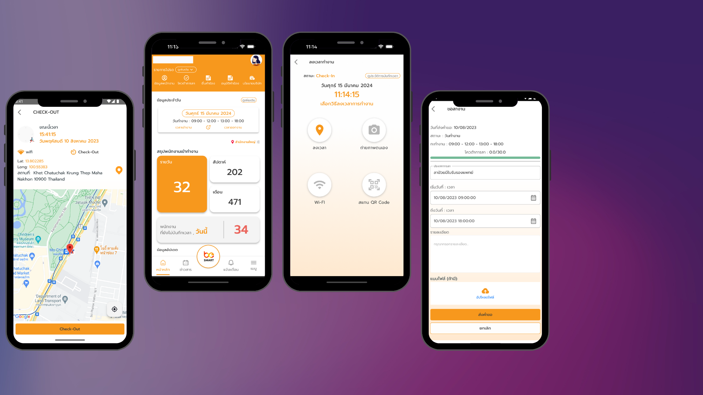

# 🏢 HRPulseMobile

> **HRPulseMobile** is a mobile application designed for managing HR processes, employee records, and internal communication efficiently.

---

## 📌 **Screenshot**

Below is a key screenshot from the application:

  

---

## 📋 **Overview**
- This app enables **HR teams and employees** to manage their work-related tasks efficiently.
- Features include **attendance tracking, leave requests, payroll management, and internal communications**.
- Developed using **Flutter** with a focus on smooth UI and performance.

---

## 🚀 **How to Use**
1. Log in with your employee credentials.
2. Access the HR dashboard for attendance, payroll, and leave requests.
3. Receive real-time notifications for important updates.

---

> **Note:** More features and details will be updated soon!

